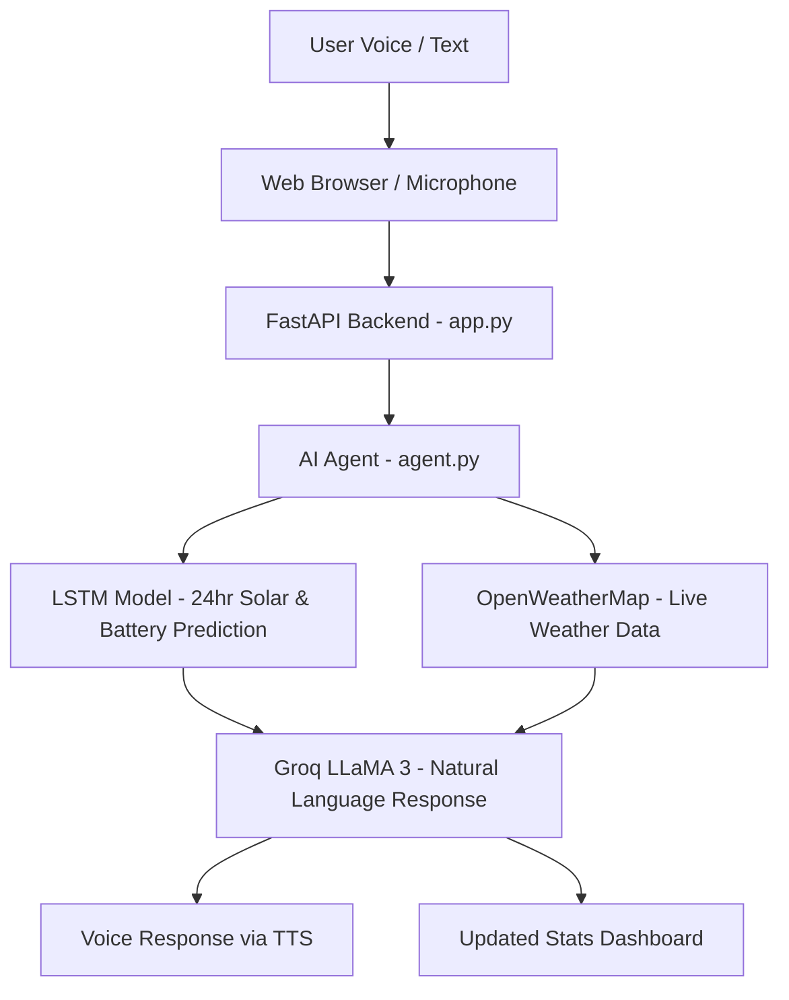

# ☀️ SolarSakhi — AI Voice Agent for Women

<div align="center">


**An AI-powered voice assistant that helps rural women manage their off-grid solar energy systems intelligently.**

*Submitted for Yesist12 2026 National Innovation Challenge*

</div>

---

## 🌟 Overview

**SolarSakhi** (Solar friend in Hindi) is an innovative AI voice agent designed specifically for **women in rural India** who rely on off-grid solar energy systems. It combines a real **LSTM neural network** for solar & battery prediction with the **Groq LLaMA 3** language model to deliver warm, actionable, voice-based energy advice.

The assistant — named **Surya** — speaks in simple, encouraging English and gives women exact times to run appliances, warns about battery safety, and calculates daily rupee savings from solar energy.

---

## 🎯 Problem Statement

Women in rural India using solar home systems often:
- Don't know the best times to run appliances (sewing machines, grinders, fans)
- Can't predict when their battery will run low
- Lack access to expert energy advice in simple language
- Waste solar energy due to poor scheduling

**SolarSakhi solves this with AI-driven predictions and a friendly voice interface.**

---

## ✨ Key Features

| Feature | Description |
|---|---|
| 🧠 **LSTM Prediction** | Real neural network model trained on Ahmedabad solar data predicting 24-hour solar generation & battery SOC |
| 🤖 **Groq AI Chat** | LLaMA 3 powered conversational AI that gives warm, simple energy advice |
| 🎤 **Voice Interface** | Browser-based speech recognition + text-to-speech (Web Speech API) |
| 🌦️ **Live Weather** | Real-time weather injection from OpenWeatherMap API into predictions |
| 💰 **Savings Calculator** | Estimates daily rupee savings from solar energy usage |
| 🔋 **Battery Safety Alerts** | Proactively warns when battery risk is detected at night |
| 📱 **Mobile-Friendly UI** | Glassmorphism web UI with chat, stats cards, mic button |
| 🗣️ **Desktop Voice Mode** | Standalone Python voice agent with microphone & speaker |

---

## 🏗️ Architecture

```
SolarSakhi/
├── agent.py          # Core AI agent: LSTM prediction + Groq LLM chat
├── app.py            # FastAPI web server (REST API + static file serving)
├── voice.py          # Standalone desktop voice agent (mic + speaker)
├── static/
│   └── index.html    # Web UI (chat, voice, stats dashboard)
├── models/
│   ├── lstm_energy_brain.keras   # Trained LSTM model
│   ├── scaler_X.pkl              # Feature scaler
│   └── scaler_y.pkl              # Output scaler
├── data/
│   └── ahmedabad_energy.csv      # Solar energy training dataset
└── .env              # API keys (not committed)
```

### How it works:



---

## 🚀 How to Run

### Prerequisites

- Python 3.8+
- A **Groq API key** (free at [console.groq.com](https://console.groq.com))
- An **OpenWeatherMap API key** (free at [openweathermap.org](https://openweathermap.org/api))

### 1. Clone the Repository

```bash
git clone https://github.com/Tanisharma122/SolarSakhi-AI-Voice-Agent-for-womens-.git
cd SolarSakhi-AI-Voice-Agent-for-womens-
```

### 2. Create Virtual Environment

```bash
python -m venv venv
# Windows:
venv\Scripts\activate
# Linux/Mac:
source venv/bin/activate
```

### 3. Install Dependencies

```bash
pip install fastapi uvicorn tensorflow groq python-dotenv pandas numpy \
            scikit-learn requests speechrecognition gtts pygame imageio-ffmpeg
```

### 4. Set Up Environment Variables

Create a `.env` file in the project root:

```env
GROQ_API_KEY=your_groq_api_key_here
GROQ_MODEL=llama3-8b-8192
OPENWEATHER_API_KEY=your_openweathermap_key_here
```

### 5. Run the Web App

```bash
uvicorn app:app --reload --port 8000
```

Then open **http://localhost:8000** in your browser.

### 6. (Optional) Run the Desktop Voice Agent

For a full voice-only experience with microphone:

```bash
python voice.py
```

---

## 💬 Example Interactions

> **User:** "My battery is at 60 percent. When should I run my sewing machine?"
>
> **Surya:** "Your battery looks great at 60%! Peak solar hits around 12:00 today, so run your sewing machine between 10 and 2 for free energy — you could save around 40 rupees!"

---

> **User:** "Is it safe to use lights tonight?"
>
> **Surya:** "I checked your battery forecast — it stays above 30% all night, so lights and fan are completely safe! Sleep well."

---

## 🧠 AI/ML Details

### LSTM Model
- **Architecture:** LSTM neural network (TensorFlow/Keras)
- **Input:** 24 hours of historical features (solar irradiance, temperature, cloud cover, wind speed, humidity, clearness index, usage kWh, time encodings)
- **Output:** Next 24 hours of solar generation (kWh) + battery SOC (%)
- **Data:** Ahmedabad solar dataset with real meteorological variables

### Groq LLaMA 3 Integration
- Model: `llama3-8b-8192`
- Conversation memory: Last 8 messages retained
- System prompt engineered for rural women energy advisory
- Max 2-3 sentences per response (optimized for voice)

---

## 🛠️ Tech Stack

| Layer | Technology |
|---|---|
| **AI Model** | TensorFlow / Keras LSTM |
| **Language Model** | Groq API (LLaMA 3) |
| **Backend** | FastAPI (Python) |
| **Frontend** | Vanilla HTML/CSS/JavaScript |
| **Voice (Web)** | Web Speech API (STT + TTS) |
| **Voice (Desktop)** | SpeechRecognition + gTTS + Pygame |
| **Weather** | OpenWeatherMap API |
| **Data Science** | Pandas, NumPy, Scikit-learn |

---

## 🌍 Social Impact

- 🎯 **Target Users:** Women in rural India with solar home systems
- 📍 **Focus Region:** Ahmedabad, Gujarat (expandable to all India)
- 💡 **Goal:** Reduce solar energy waste, prevent battery failure, empower women with AI tools
- 🗣️ **Language:** Simple English (future: Hindi/Gujarati voice support)

---

## 👩‍💻 Project by

**Tanisha Sharma**
*Submitted for Yesist12 2026 National Innovation Challenge*

---

## 📄 License

This project is open-source and available under the [MIT License](LICENSE).

---

<div align="center">
Made with ❤️ to empower women through technology ☀️
</div>
